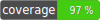

## PHP Collections Library

[](https://github.com/Squirrafe/PhpCollections/actions/workflows/workflow.yaml)
[](https://github.com/Squirrafe/PhpCollections/blob/main/LICENSE)
[](https://packagist.org/packages/squirrafe/collections)



Collections library for PHP, inspired by Scala.

Install with Composer:

```shell
composer require squirrafe/collections
```

See documentation at [GitHub Pages](https://squirrafe.github.io/PhpCollections/).

#### Supported PHP versions

| PHP Version | Is supported?      | Latest library version with support                                            |
|-------------|--------------------|--------------------------------------------------------------------------------|
| 8.1         | :white_check_mark: | [Current version](https://github.com/Squirrafe/PhpCollections/releases/latest) |
| 8.0         | :white_check_mark: | [Current version](https://github.com/Squirrafe/PhpCollections/releases/latest) |
| 7.4         | :white_check_mark: | [Current version](https://github.com/Squirrafe/PhpCollections/releases/latest) |

#### Development

Library uses Docker Compose during development.

To install dependencies:
```shell
docker-compose run php composer install
```

To run tests:

```shell
docker-compose run php vendor/bin/phpunit
docker-compose run php vendor/bin/phpstan analyze
```
