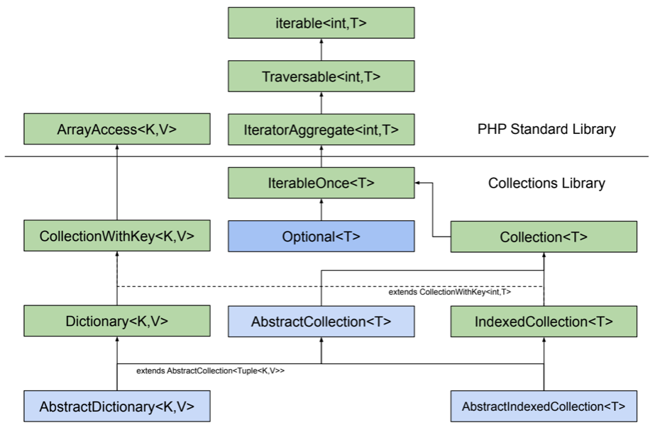

## Type structure

Basic interfaces and abstract classes:

* `IterableOnce<T>` contains methods for collections that allow iterations (mapping, filtering, folding, reducing,
  counting). It extends `IteratorAggregate<int,T>` interface from PHP standard library, which allows using instances
  in `foreach` loops. All collection classes in this library implement that interface.
* `Collection<T>` extends `IterableOnce<T>` and adds support for collections that can contain more then one element.
  All collection classes in this library except for `Optional<T>` implement that interface.
  * `AbstractCollection<T>` has basic common implementations of methods in `Collection<T>` and `IterableOnce<T>`
    interfaces.
* `CollectionWithKey<K,V>` is the first collection interface that predicts accessing collection by some key with
  `get($key)` method. It extends `ArrayAccess<K,V>` interface from PHP standard library, allowing usage of `[$key]`
  operator as well, and defines an `__invoke(K $key): V` method, allowing to treat collection as a function that
  accepts values of type `K` and return values of type `V`.
* `IndexedCollection<T>` is a basic interface for all collections in which keys are integer numbers from 0 to N-1, where
  N is a size of collection. It extends `Collection<T>` and `CollectionWithKey<int,T>`.
* `Dictionary<K,V>` is a basic interface for all dictionaries - collections of (key, value) pairs such that each possible
  key can appear at most once.